# 第三章 运输层

## 3.1 运输层概述

## 3.2 端口与套接字

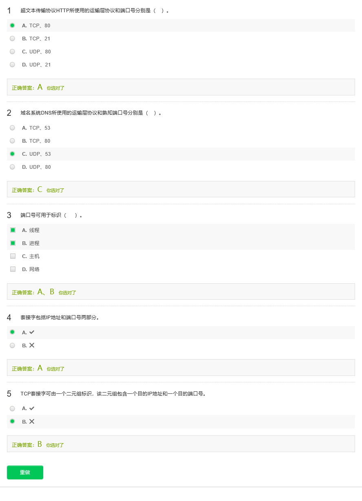

## 3.3 无连接传输

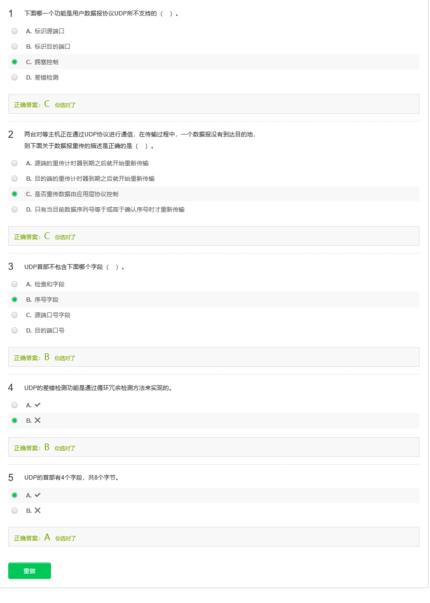

## 3.4 数据可靠传输描述

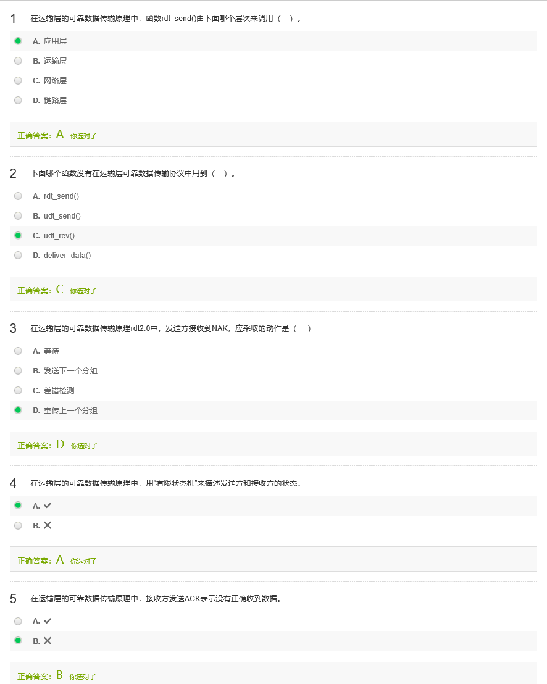

## 3.5 简单停等协议

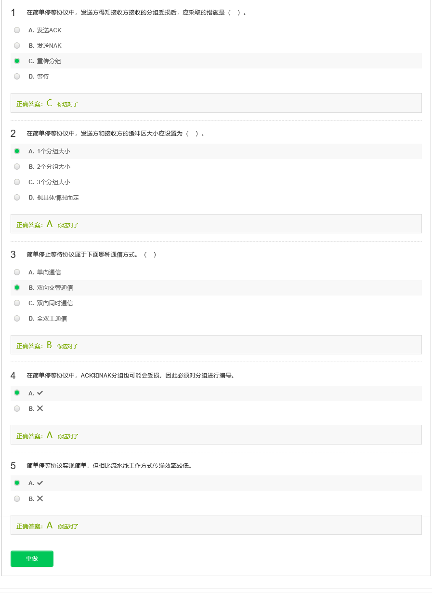

## 3.6 实用停等协议

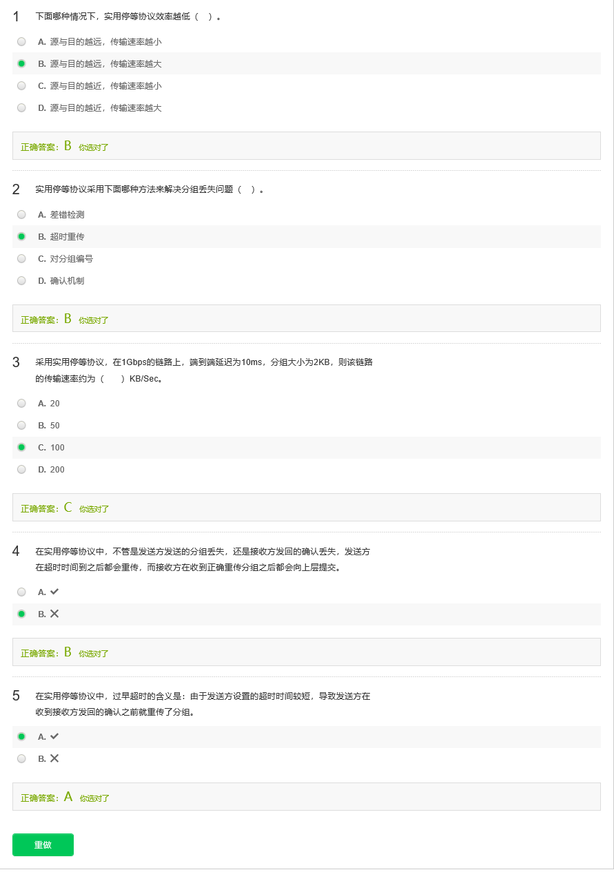

## 3.7 滑动窗口协议

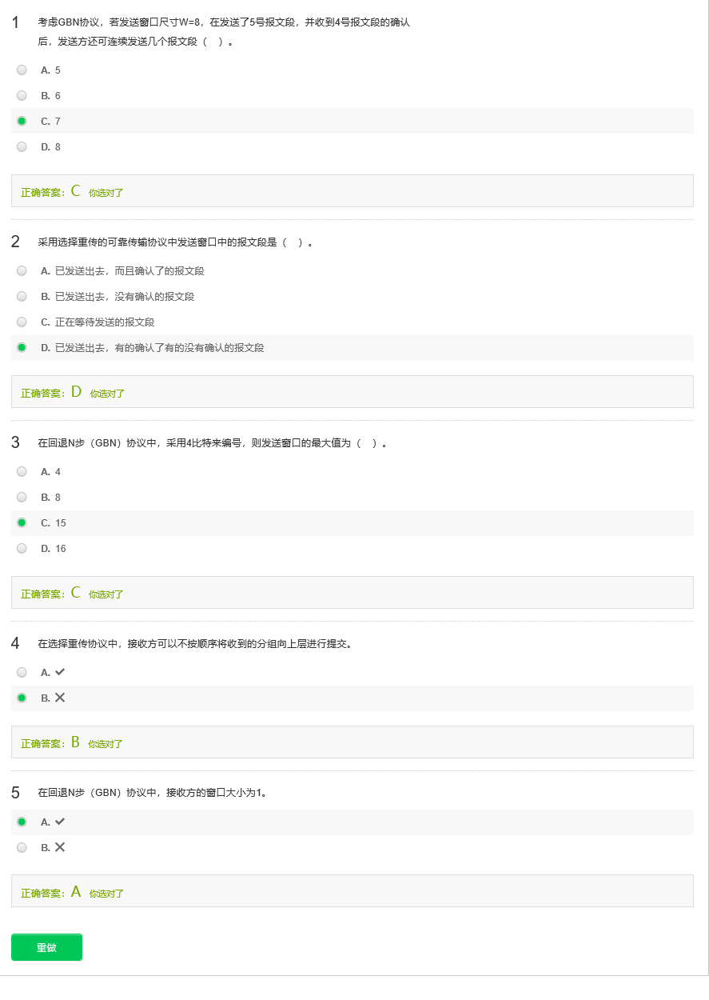

## 3.8 TCP报文段首部结构

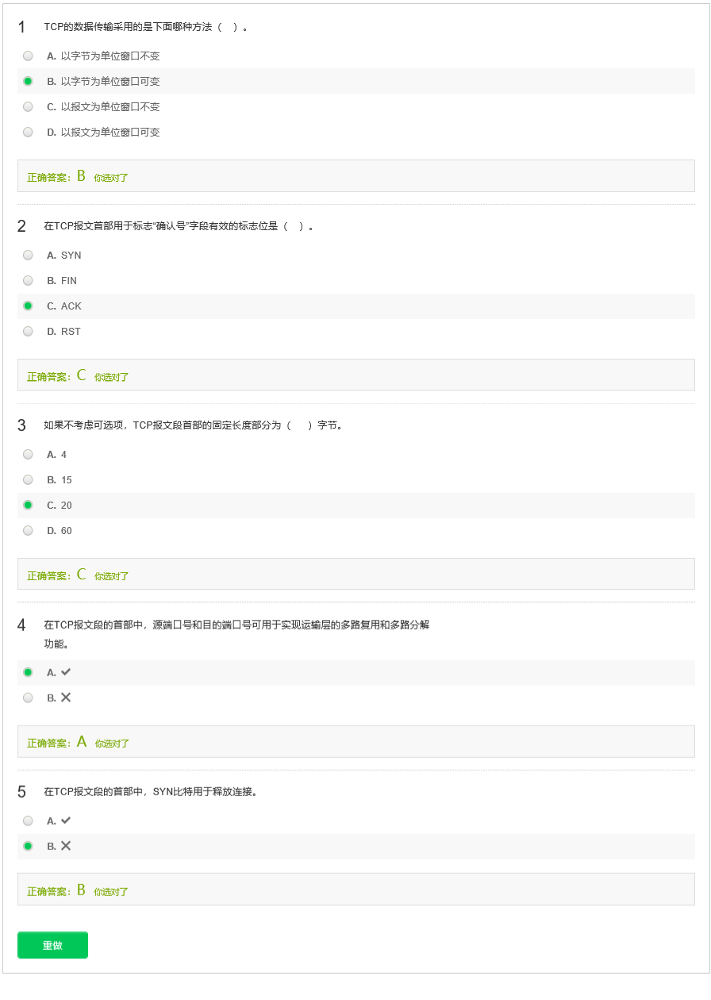

## 3.9 TCP中的序列号和ACK

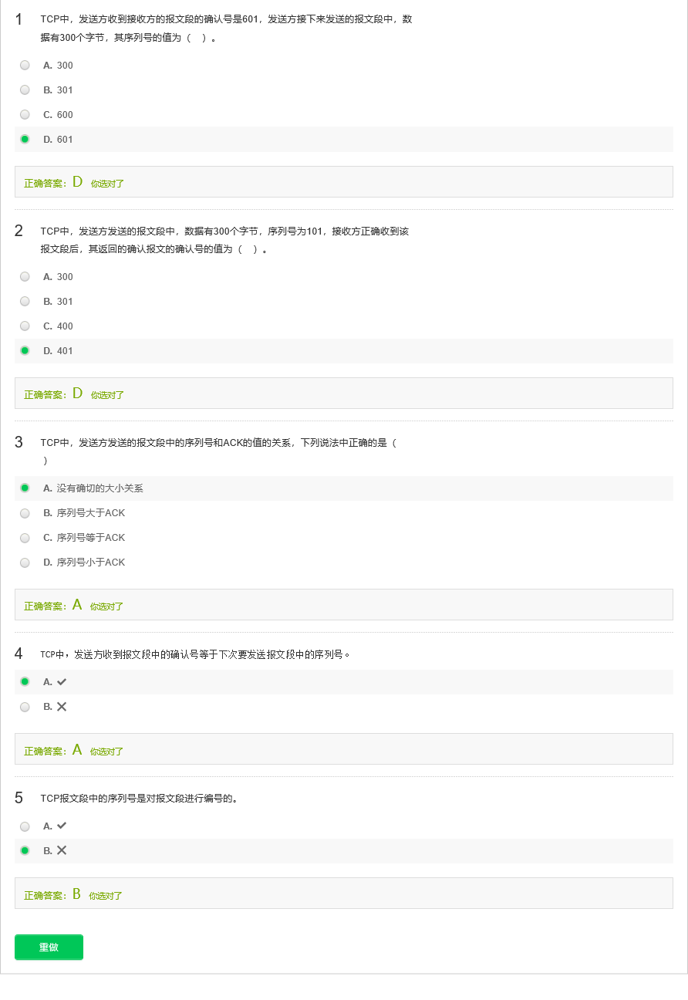

## 3.10 TCP超时时间间隔的设置

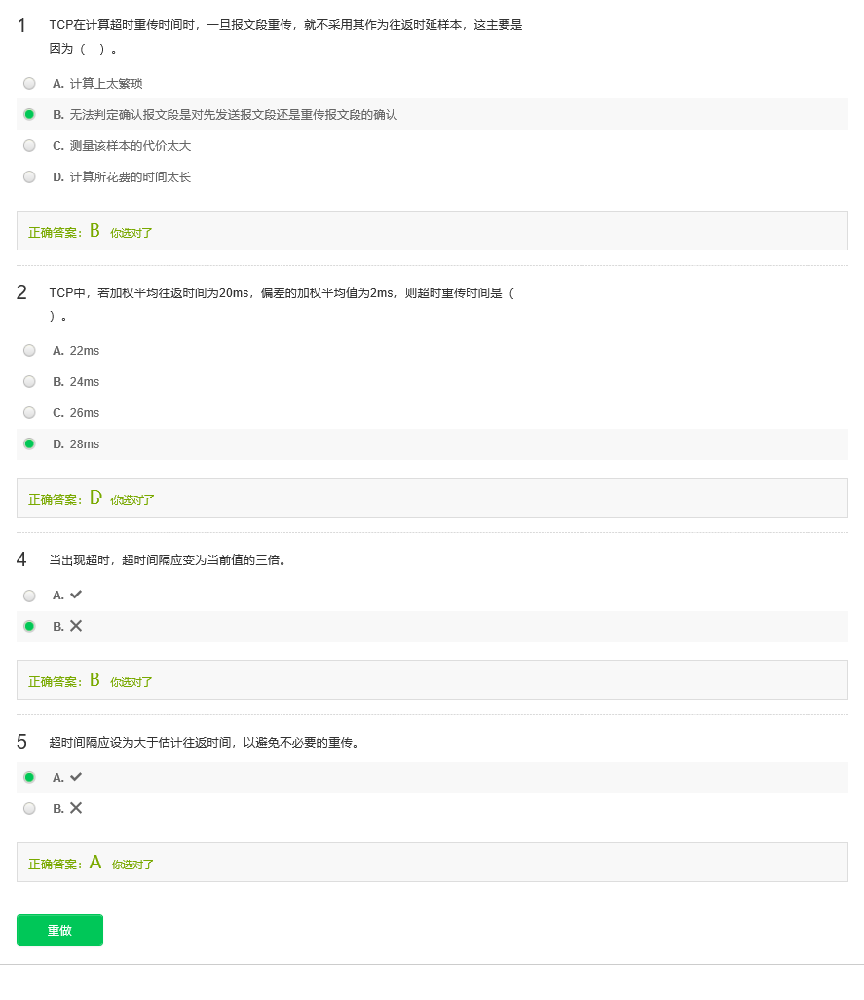

## 3.11 TCP的可靠数据传输

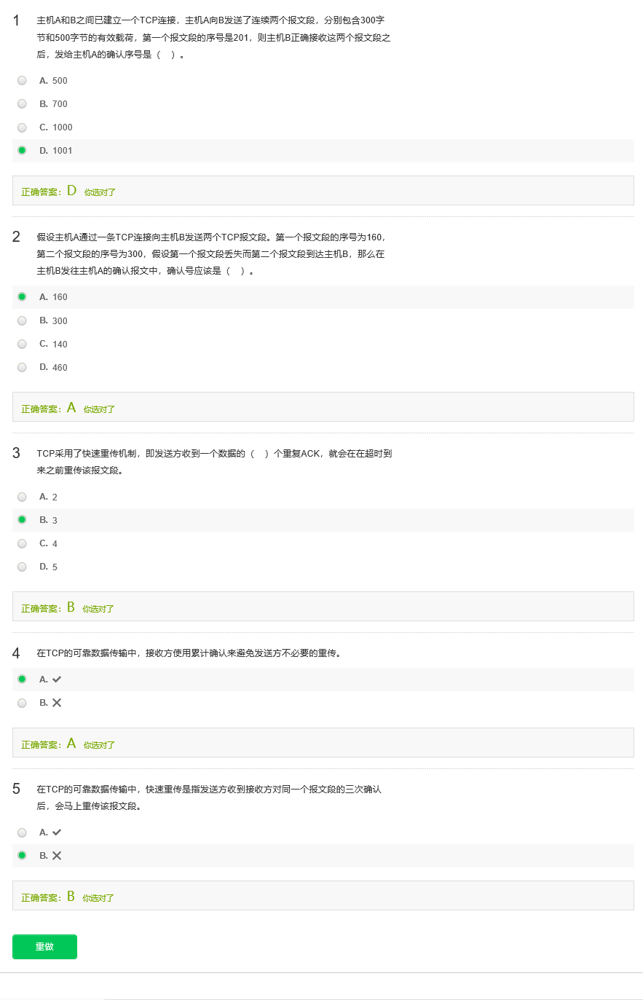

## 3.12 TCP的流量控制

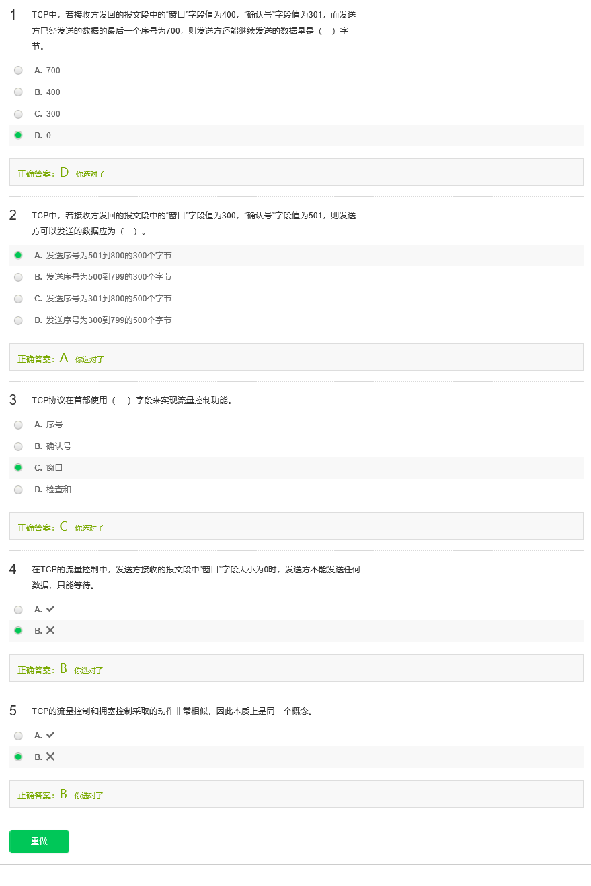

## 3.13 TCP的连接管理

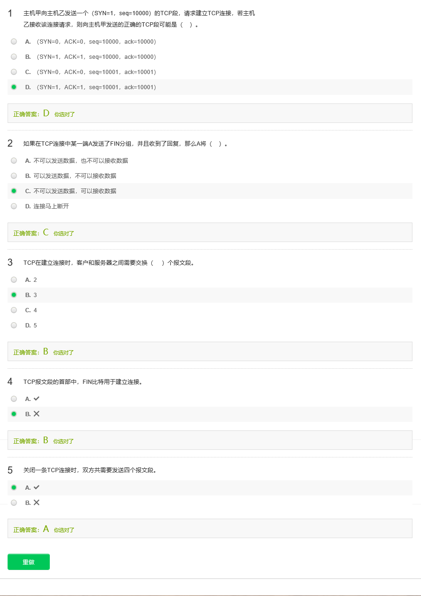

## 3.14 拥塞控制概述

## 3.15 TCP的拥塞控制

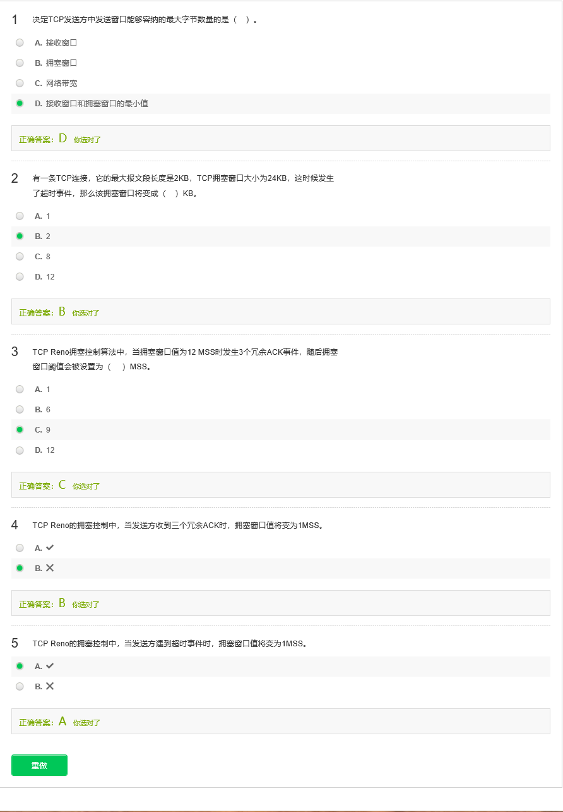