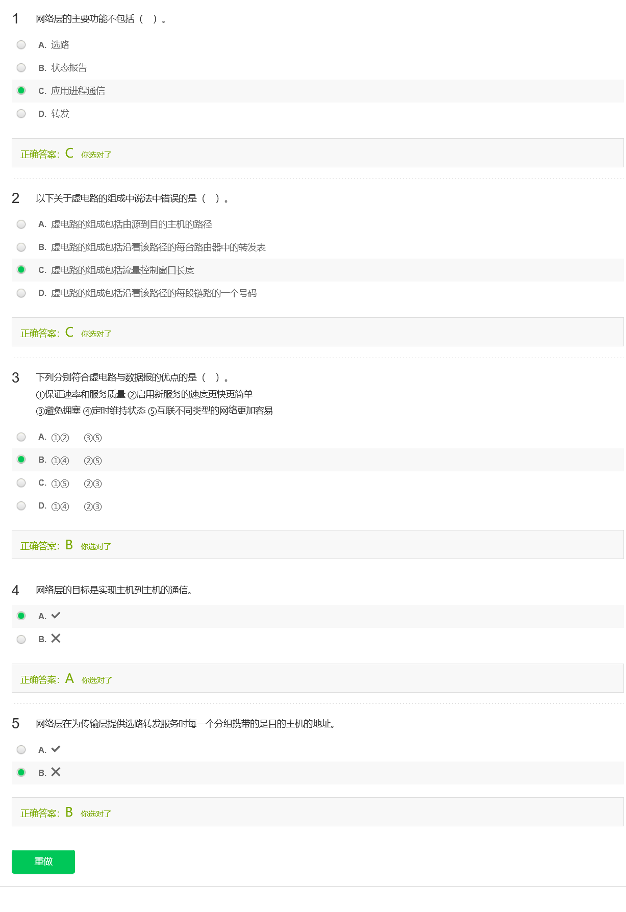

# 第四章 网络层

## 4.1 网络层概述

## 4.2 路由器工作原理

## 4.3 IP协议数据报格式

## 4.4 IP地址

## 4.5 子网划分

## 4.6 CIDR

## 4.7 网络地址转换NAT

## 4.8 ICMP协议

## 4.9路由协议概述

## 4.10 链路状态选路算法和OSPF协议

## 4.11 距离向量选路算法和RIP协议

## 4.12 BGP-4协议

## 4.13 SDN与控制平面

## 4.14 Openstack与数据平面

